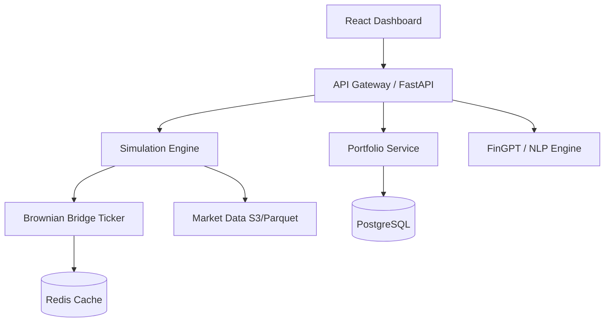

<p align="center">
  
</p>

<p align="center">
  
  
  
  
  
</p>

---

# TradeShift: The Flight Simulator for Traders 🚀

**TradeShift** is a high-fidelity market replay and paper trading platform engineered to bridge the gap between retail curiosity and institutional execution. Designed for the modern era of algorithmic and discretionary trading, TradeShift provides a risk-free environment to master the markets using historical data and realistic simulation.

---

## 🗺️ Table of Contents

- [✨ Vision & The Problem](#-vision--the-problem)
- [🛠️ Core Features](#-core-features)
- [🏗️ System Architecture](#-system-architecture)
- [📸 Screenshots](#-screenshots)
- [📦 Technology Stack](#-technology-stack)
- [🚦 Getting Started](#-getting-started)
- [🗺️ Roadmap](#-roadmap)
- [🤝 Contributing](#-contributing)
- [🌟 The Team](#-the-team)
- [📄 License](#-license)

---

## ✨ Vision & The Problem

Millions of retail traders enter the financial markets every year with ambition but without a safe harbor for practice. Most paper trading tools suffer from two critical flaws:
1. **Simplified Simulation**: Using linear interpolation between price points, failing to capture the "noise" and liquidity gaps of real markets.
2. **Limited Availability**: Forcing users to wait for live market hours to practice.

**TradeShift** solves this by providing a "Flight Simulator" experience. We leverage a custom **Brownian Bridge algorithm** to generate realistic, tick-by-tick price action from historical OHLC data. Whether it's 2015 or last Tuesday, you can replay any market day at variable speeds—mastering price action while the world sleeps.

Our vision is a **zero-cost** platform that utilizes free Indian broker APIs (like Shoonya and Angel One) and open-source datasets to deliver professional-grade tools to every hobbyist.

---

## 🛠️ Core Features

| Feature | Description |
| :--- | :--- |
| **🚀 Replay Engine** | Play back any day from 2015 onward at **1x, 5x, 10x, or 100x** speed. |
| **🎯 Punch Trading** | Institutional-grade one-click execution directly from the chart. No complex forms. |
| **🛡️ Punch Protection** | Set daily loss limits. Once hit, the trade button "shatters" and requires an override. |
| **📈 Visual Risk Mgmt** | Drag-and-drop Stop-Loss and Take-Profit lines with real-time P&L calculation. |
| **🖥️ Multi-Chart Mode** | Side-by-side scalper view for correlating Spot and Options price action. |
| **🧠 AI Co-Pilot** | FinGPT-powered analysis of your trades and historical news context. |
| **📰 Narrative Layer** | Historical news headlines and social sentiment overlaid on the replay timeline. |

---

## 🏗️ System Architecture

TradeShift is designed with a modular, microservices-ready architecture, starting as a clean, highly-performant monolith.



### Key Components:
- **Ticker Synthesizer**: Converts historical bars into 60-tick per minute micro-movements.
- **OMS (Order Management System)**: Tracks virtual positions, margins, and risk limits.
- **Research Hub**: Provides institutional-grade fundamental deep dives via AI.

---

## 📸 Screenshots

<p align="center">
  
  <br>
  <em>Figure 1: High-fidelity market replay during a high-volatility session.</em>
</p>

---

## 📦 Technology Stack

| Layer | Technologies |
| :--- | :--- |
| **Frontend** | React, TypeScript, Vite, TradingView Lightweight Charts, D3.js |
| **Backend** | Python, FastAPI |
| **Data Lake** | Parquet, S3 / MinIO |
| **Persistence** | PostgreSQL, TimescaleDB, Redis (Caching) |
| **AI/ML** | Google Gemini (GenAI), Hugging Face (NLP) |
| **DevOps** | Docker, Docker Compose, GitHub Actions, Prometheus, Grafana |

---

## 🚦 Getting Started

### 🐳 Option 1: Docker (Recommended)
The quickest way to get TradeShift running is via Docker Compose.

1. **Set Up Environment Variables**
   Before running Docker, securely set up your API keys. Copy the example file and edit it:
   ```bash
   cp backend/.env.example backend/.env
   # Edit backend/.env to include your NEWSAPI_KEY, ALPHA_VANTAGE_KEY, etc.
   ```

2. **Start the Containers**
   ```bash
   git clone https://github.com/Ritsham/tradeshift-engine.git
   cd tradeshift-engine
   docker-compose up -d
   ```
   Visit `http://localhost:5173` to start practicing.

### 🛠️ Option 2: Manual Development
**Backend:**
```bash
cd backend
python -m venv venv
source venv/bin/activate
pip install -r requirements.txt
uvicorn main:app --reload
```

**Frontend:**
```bash
cd frontend
npm install
npm run dev
```

---

## 🗺️ Roadmap

| Phase | Milestone | Timeline | Status |
| :--- | :--- | :--- | :--- |
| **Phase 1** | **Core Simulator**: High-fidelity replay engine & basic OMS. | Q1 2024 | ✅ |
| **Phase 2** | **Social & Scale**: Leaderboards, user accounts, and contests. | Q3 2024 | 🏗️ |
| **Phase 3** | **Learning & AI**: FinGPT integration & automated trade journaling. | Q1 2025 | 🚀 |
| **Phase 4** | **Options & Community**: Strategy builder & community scripts. | Q3 2025 | 🗺️ |

---

## 🤝 Contributing

We welcome contributions from the community! Whether you're fixing a bug, adding a new feature, or improving documentation, please feel free to open a Pull Request.

Please read our [CONTRIBUTING.md](CONTRIBUTING.md) for details on our code of conduct and the process for submitting pull requests.

---

## 🌟 The Team

- **The Engine Builder**: Architecture & Simulation logic.
- **The Interface Magician**: Seamless UX/UI & Visualizations.
- **The Data Gatherer**: Market data ingestion & AI training.

---

## 📄 License

This project is licensed under the MIT License - see the [LICENSE](LICENSE) file for details.

---

<p align="center">
  <b>If you find this project useful, give it a star! ⭐</b>
</p>