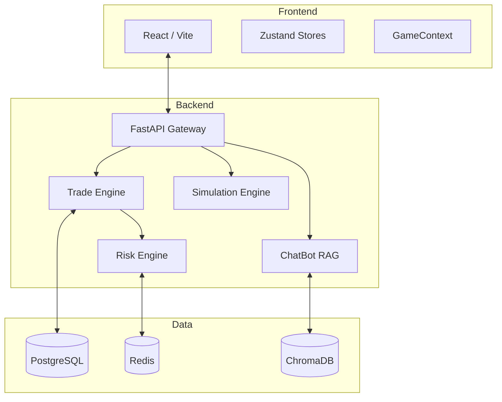

# TradeShift Engine: Comprehensive Developer Guide

## 1. Project Vision & Mission
**TradeShift** is a high-fidelity market replay and paper trading platform designed to bridge the gap between retail theoretical knowledge and institutional execution reality. It serves as a "Flight Simulator" for traders, providing a risk-free environment to master market dynamics using historical data and realistic micro-movements.

### The Problem
Retail traders often fail due to:
- **Poor Practice Tools**: Most paper trading tools use linear interpolation, hiding the "noise" and volatility of real markets.
- **Limited Practice Time**: Traditional tools require live market hours.
- **Lack of Narrative Context**: Charts alone don't explain *why* the market moved.

### The Solution: TradeShift
TradeShift provides:
1. **Realistic Simulation**: Brownian Bridge algorithms to synthesize tick-by-tick action.
2. **Infinite Replay**: Practice any day from the past decade, anytime.
3. **Narrative Layer**: AI-synced news and sentiment analysis integrated into the chart.

---

## 2. Technology Stack & Rationale

| Layer | Technology | Rationale |
| :--- | :--- | :--- |
| **Frontend** | React 18 + Vite | Modular component architecture with ultra-fast HMR for rapid UI iteration. |
| **State** | Zustand + Context | Zustand for high-frequency chart updates; Context for global simulation state. |
| **Charts** | Lightweight Charts | Institutional-grade performance for rendering thousands of candles and drawings. |
| **Backend** | FastAPI (Python) | High-performance asynchronous API specifically suited for real-time market data. |
| **Persistence** | PostgreSQL | Robust relational data for trade logs, user profiles, and settings. |
| **Caching** | Redis | Low-latency risk validation and session state management. |
| **AI/ML** | Google Gemini | State-of-the-art LLM for narrative analysis and RAG-based assistance. |
| **Search** | ChromaDB | Vector database for efficient semantic search in market knowledge bases. |
| **DevOps** | Docker | Consistent environment across development and production. |

---

## 3. System Architecture

The system follows a microservices-ready modular monolith pattern.

### Key Communication Patterns
- **REST API**: Standard CRUD for profiles, settings, and trade execution.
- **WebSockets**: Real-time price streaming and order lifecycle updates (Trigger -> Fill -> Close).
- **Internal Workers**: Background tasks for data ingestion and technical analysis calculation.

---

## 4. Backend: The Core Engines

### 4.1 Simulation Engine (The Ticker Synthesizer)
The `TickSynthesizer` in `backend/app/simulation.py` is the heart of the "Flight Simulator". Unlike simple interpolation, it uses a **Brownian Bridge** algorithm.

**Algorithm Highlights:**
- **Exact Endpoints**: Guarantees the path starts at Open and ends at Close.
- **Natural Extremes**: Injects "pivots" at random points in the candle to ensure the price touches the High and Low naturally.
- **Momentum Clustering**: Uses an AR(1) filter to simulate short-term trends where price movements are autocorrelated, preventing "jagged" or random-walk-only visuals.
- **Soft Clamping**: Uses a sigmoid squeeze function at High/Low boundaries to avoid the "flat wall" effect seen in inferior simulators.

### 4.2 Trade & Risk Engine
The system enforces institutional-grade risk management.
- **Pre-Trade Validation**: Every order is intercepted by the `Risk Engine` to check against `max_daily_loss` and `max_order_quantity`.
- **Linked Orders**: When a MARKET order is filled, the engine automatically creates "child" PENDING orders for Stop-Loss (STOP) and Take-Profit (LIMIT).
- **OMS Lifecycle**: The Order Management System monitors incoming price ticks. If a price touches an SL/TP target, the OMS executes the fill and cancels the "sibling" order (OCO - One Cancels Other).

---

## 5. Frontend Deep Dive

### 5.1 Multi-Chart Grid System
TradeShift supports a professional multi-chart layout.
- **State Management**: `useMultiChartStore` manages an array of chart configurations (symbol, timeframe, data).
- **Synchronization**: `Home.tsx` acts as the orchestrator, syncing the "Active" chart with the global `useGame` context.
- **Performance**: Each chart instance is memoized, and data fetching is siloed per chart slot to prevent redundant network calls.

### 5.2 Drawing & Indicator Framework
- **Custom Tools**: Overlays like Fibonacci, Trendlines, and Rectangles are managed via custom hooks (`useDrawingTools`).
- **Persistence**: Drawings are serialized into JSON and saved to PostgreSQL via the `user_chart_settings` table, allowing traders to resume analysis across sessions.

---

## 6. AI Integration: Narrative & Assistance

### 6.1 FinGPT Narrative Layer
Instead of just showing charts, TradeShift overlays historical news events. The `nlp_engine.py` analyzes news headlines to provide:
- **Sentiment Scoring**: Positive/Negative/Neutral badges.
- **Market Impact Predictions**: AI-estimated volatility based on news content.

### 6.2 TradeGuide (AI ChatBot)
A RAG (Retrieval-Augmented Generation) system:
- **Retrieval**: Uses `ChromaDB` and `sentence-transformers` to find relevant trading educational content.
- **Augmentation**: The user query is augmented with this local knowledge and sent to Gemini.
- **Verification**: The system filters for "safe" output (no future predictions or financial advice).

---

## 7. Database Schema & Data Design

### 7.1 Relational Schema (PostgreSQL)
- **trade_logs**: Unified storage for all trades and orders.
- **portfolio_holdings**: Tracks active exposure, separated by session type (LIVE vs REPLAY).
- **user_settings**: Stores risk limits and circuit breakers.
- **instruments_master**: A high-performance lookup table for ticker symbols.

### 7.2 Storage (MinIO)
Large historical datasets (1-minute bars) are stored as compressed Parquet files in object storage, providing fast read performance for the simulation engine.

---

## 8. Critical Decision Making & Evolution

### Why separate ChatBot and Main Backend?
Early in development, AI dependencies (Torch, Transformers) bloating the main backend container caused slow startup and CI/CD bottlenecks. We decoupled the ChatBot into a microservice to:
- Scale AI resources independently.
- Prevent model loading from blocking standard API requests.
- Allow specialized Docker environments for AI libraries.

### Why Zustand + Context?
- **Context**: Used for "Game State" (Simulation Time, Active Symbols) where many components need to react to a single change.
- **Zustand**: Used for "UI State" (Chart Layouts, Selected Tools) where we need fine-grained control and transient updates without re-rendering the entire app.

---

## 9. Errors Resolved & Tackled

| Error | Root Cause | Resolution |
| :--- | :--- | :--- |
| **Instrument Sync Bug** | `GlobalTicker` updated global state but not the active chart slot. | Implemented store synchronization in `Home.tsx` to link global symbol to the active chart. |
| **Toolbar Clipping** | `overflow: auto` on the sidebar cut off floating tool menus. | Refactored child menus to render outside the scroll container with dynamic positioning. |
| **ChatBot Connection Refused** | Python relative imports failed when running in Docker as a script. | Normalized all imports to absolute paths and implemented a robust health-check polling system. |
| **Favorites Out-of-Bounds** | Toolbar could be dragged off-screen, becoming unrecoverable. | Implemented boundary clamping and window-resize safety listeners. |

---

## 10. Current Status & Future Roadmap
**Status**: Stable Core Simulation. Multi-chart, Drawing Tools, and AI Assistance fully functional.
**Next Steps**:
- **Phase 2**: Multi-user contests and leaderboards.
- **Phase 3**: Integration with Indian Broker APIs (Shoonya) for real paper trading.
- **Phase 4**: Options Strategy Builder (Greeks visualization).

---

## 11. Core File Map (Developer Directory)

### 11.1 Backend (`backend/app/`)
- `main.py`: The API entry point. Orchestrates the FastAPI app, middleware, and route registration.
- `models.py`: SQLAlchemy database models. The "Source of Truth" for the relational schema.
- `trade_engine.py`: Logic for executing orders, linking SL/TP, and preparing WebSocket updates.
- `simulation.py`: The `TickSynthesizer` implementation (Brownian Bridge logic).
- `oms.py`: The Order Management System that monitors ticks and fills pending orders.
- `services/risk_engine.py`: Validates order quantity and daily loss limits against Redis/Postgres.
- `websocket_manager.py`: Manages active connections and broadcasts real-time price/order events.

### 11.2 Frontend (`frontend/src/`)
- `context/GameContext.tsx`: The primary state engine for simulation timing, price streaming, and portfolio totals.
- `store/useMultiChartStore.ts`: Zustand store for managing the grid of charts and their independent symbols.
- `components/ProChart/ProChart.tsx`: The wrapper for Lightweight Charts, handling data sync and drawing layers.
- `hooks/useDrawingTools.ts`: Logic for creating and manipulating chart overlays (Lines, Fibonacci, etc.).
- `pages/Home.tsx`: The main trading dashboard, orchestrating sidebar panels and chart grids.
- `services/MarketDataService.ts`: Handles communication with the historical data API and Parquet ingestion.

### 11.3 AI ChatBot (`backend/chatbot/`)
- `main.py`: FastAPI entry point for the AI microservice.
- `bot.py`: The RAG implementation using `ChromaDB` for retrieval and `Gemini` for generation.
- `ingest.py`: Script for embedding local knowledge base articles into the vector database.

---
## 12. Final Developer Status
The project is currently in a **Stable Alpha** state. Core features like high-fidelity replay and multi-chart analysis are robust. Development is now shifting toward institutional-grade features like automated strategy testing and real-broker integration.
