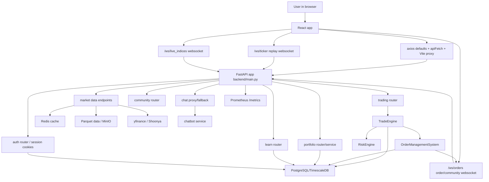

# TradeShift Codebase Bible

This document is your operating manual for becoming the owner of TradeShift.

The goal is not only to remember file names. The goal is to build a mental model of the system:

- where users enter
- where requests enter
- how data moves
- where state changes
- which tables are written
- which services are expensive
- where latency and failures can appear
- how to debug production issues without searching blindly

Use this as a living document. Add notes every time you trace a feature, fix a bug, learn a table, or discover a failure mode.

## 0. How To Study This Codebase

Do not read files randomly.

Use this loop:

1. Pick one user action.
2. Find the frontend component or context function that starts it.
3. Follow the API call.
4. Find the FastAPI route.
5. Follow service calls.
6. Identify database reads and writes.
7. Identify side effects: WebSocket events, emails, cache writes, background tasks, analytics.
8. Ask what fails if Redis, DB, external APIs, WebSockets, or auth cookies break.
9. Write the trace back into this document.

Your daily question is:

```text
When this button is clicked, what code runs next, what state changes, and what can fail?
```

## 1. System Overview

TradeShift is a full-stack trading simulator and learning platform.

The core product is a replay trading experience:

```text
User
  -> React/Vite frontend
  -> FastAPI backend
  -> replay data loader / market service / trade engine / OMS
  -> PostgreSQL or TimescaleDB
  -> Redis cache
  -> WebSockets back to browser
  -> optional chatbot, news worker, MinIO, RabbitMQ
```

### Main Runtime Components

| Layer | Code | Runtime | Purpose |
| --- | --- | --- | --- |
| Frontend app | `frontend/src` | Vite + React + TypeScript | UI, charts, replay controls, auth screens, portfolio, learning, community |
| Backend API | `backend/main.py`, `backend/app` | FastAPI + Python | REST APIs, auth, market data, trading, WebSockets, scheduler, monitoring |
| Database | `backend/app/models.py`, `database/*.sql` | PostgreSQL/TimescaleDB | users, sessions, trades, holdings, learning content, notifications, news |
| Cache | `backend/app/redis_utils.py`, `backend/main.py` | Redis | historical candle cache, market cache, optional session identity cache |
| Object/data storage | `backend/data`, MinIO config | Parquet + MinIO/S3 compatible | historical market data files |
| Chatbot | `backend/chatbot` | separate FastAPI service | TradeGuide / RAG-like chat service with backend fallback |
| Worker | `backend/workers/news_worker.py` | RabbitMQ profile | async news ingestion/processing |
| Observability | `/metrics`, `backend/prometheus.yml` | Prometheus instrumentation | API metrics and replay health |
| Deployment | `docker-compose.yml`, `frontend/Dockerfile`, `backend/Dockerfile`, `netlify.toml` | Docker, Netlify, VM | local and deployed runtime |

### Architecture Diagram



## 2. Repository Map

```text
.
|-- frontend/                 React/Vite app
|   |-- src/App.tsx           route tree and provider composition
|   |-- src/main.tsx          axios/fetch backend routing setup
|   |-- src/context/          app-wide state providers
|   |-- src/pages/            route-level screens
|   |-- src/components/       reusable UI, chart, trade, layout components
|   |-- src/services/         API and WebSocket service wrappers
|   |-- src/store/            Zustand stores
|   |-- src/hooks/            app hooks for chart, analytics, learning, access
|   `-- vite.config.ts        dev proxy for /api, /auth, /ws
|
|-- backend/
|   |-- main.py               FastAPI app, middleware, core endpoints, WebSockets
|   |-- app/
|   |   |-- auth.py           auth routes and password/session helpers
|   |   |-- dependencies.py   current-user/admin dependencies
|   |   |-- database.py       async/sync SQLAlchemy engine setup
|   |   |-- models.py         ORM table definitions
|   |   |-- schemas.py        Pydantic API models
|   |   |-- trade_engine.py   trade creation and execution logic
|   |   |-- portfolio_service.py
|   |   |-- websocket_manager.py
|   |   |-- routers/          feature routers
|   |   |-- services/         OMS, risk, email, community, live market, etc.
|   |   `-- utils/            money, portfolio sync, Gemini pool, etc.
|   |-- chatbot/              separate chat service
|   |-- data/                 local Parquet historical data
|   |-- scripts/              DB/data/setup/load/maintenance scripts
|   `-- tests/                backend tests
|
|-- database/                 SQL migrations and schema fixes
|-- load_tests/               scalability notes and load scripts
|-- docker-compose.yml        local multi-service runtime
|-- netlify.toml              frontend deployment config
`-- docs/                     documentation and generated reports
```

## 3. Technology Concepts You Must Understand

### React Frontend

React is the UI runtime. In this project it is responsible for:

- rendering routes and pages
- holding client state in contexts and Zustand stores
- calling REST APIs through axios/fetch
- maintaining WebSocket connections
- updating charts from replay ticks
- showing optimistic UI for order cancellation and portfolio updates

Key concept: frontend state is not the database. It is a temporary model of the current user session. The backend is the source of truth for trades, sessions, users, holdings, notifications, and learning progress.

### FastAPI Backend

FastAPI receives HTTP and WebSocket traffic.

In TradeShift:

- route functions validate request data
- dependencies resolve current user and database sessions
- service classes contain business logic
- SQLAlchemy persists state
- background tasks perform non-blocking work
- WebSockets stream market data and push order/community events

Key concept: route functions should be thin. If a route becomes the place where business rules live, debugging becomes harder.

### SQLAlchemy and PostgreSQL

SQLAlchemy maps Python classes to database tables.

In this codebase:

- tables live in `backend/app/models.py`
- sessions are created in `backend/app/database.py`
- async routes use `AsyncSession`
- startup may create tables only for local DBs
- remote DB startup avoids eager schema sync to keep boot non-blocking

Key concept: every important product action eventually becomes a table read, table write, cache write, WebSocket event, or external API call.

### WebSockets

REST is request/response. WebSocket is a long-lived connection.

TradeShift uses WebSockets for:

- replay ticks: `/ws/ticker`
- order/community events: `/ws/orders`
- live index updates: `/ws/live_indices`

Key concept: WebSockets create concurrency and lifecycle problems. You must think about connection auth, disconnects, slow clients, message ordering, and cleanup.

### Redis

Redis is an optional fast cache.

In TradeShift:

- historical candles are cached with keys like `hist:v2:{symbol}:{date}:{interval}:{lookback}:{limit}`
- market/cache helpers continue without Redis when unavailable
- Redis failure should slow the system, not destroy core behavior

Key concept: cache is an optimization unless the code makes it required. Always know whether a feature has a DB/file fallback.

### Docker Compose

`docker-compose.yml` defines local services:

- `db`: TimescaleDB/PostgreSQL on host port `5433`
- `redis`: Redis on host port `6380`
- `redis-commander`: Redis GUI under `dev-tools` profile
- `minio`: S3-compatible object storage on `9000` and console `9001`
- `backend`: FastAPI on `8000`
- `frontend`: Vite on `5173`
- `rabbitmq`: optional async news profile
- `worker`: optional news worker
- `chatbot`: chatbot service on `8001`

Key concept: Docker Compose is infrastructure-as-code for local development. Reading it tells you which services the app expects.

## 4. Frontend Entry Points

### App Boot

File: `frontend/src/main.tsx`

Responsibilities:

- imports global styles
- initializes analytics
- sets `axios.defaults.baseURL`
- sets `axios.defaults.withCredentials = true`
- monkey-patches `window.fetch` so relative `/api` calls are sent to the configured API base
- renders `App` inside `BrowserRouter`

Important detail:

```text
API_BASE = https://20.40.42.232.nip.io
```

This means many frontend API calls target that VM by default. In local development, Vite also has a proxy in `frontend/vite.config.ts`, but the hardcoded API base can override locality for axios and `/api` fetch calls.

Study question:

```text
When running locally, do I want requests to hit localhost:8000 or the deployed VM?
```

### Route Tree

File: `frontend/src/App.tsx`

Providers:

```text
ThemeProvider
  AuthProvider
    AccessProvider
      NotificationProvider
        GameProvider
          TutorialProvider
            AppContent
```

Routes:

| Route | Component | Meaning |
| --- | --- | --- |
| `/` | `LandingPage` | public landing |
| `/login` | `Login` | login |
| `/signup` | `Signup` | signup |
| `/pin-verify` | `PinVerification` | security PIN verification |
| `/forgot-password` | `ForgotPassword` | reset flow |
| `/trade` | `Home` | main trading/replay surface |
| `/markets` | `MarketPage` | market overview |
| `/screener` | `ScreenerPage` | stock screening |
| `/portfolio` | `PortfolioPage` | holdings, positions, summary |
| `/learn` | `LearnPage` | learning dashboard |
| `/learn/track/:trackId` | `TrackDetailPage` | track detail |
| `/learn/module/:moduleId` | `ModuleDetailPage` | module detail |
| `/learn/chapter/:subModuleId` | `SubModuleDetailPage` | chapter detail |
| `/learn/secret/:secretId` | `SecretDetailPage` | market secret |
| `/learn/:trackId/:lessonId` | `LessonViewerPage` | lesson viewer |
| `/news` | `NewsPage` | news UI |
| `/community` | `CommunityPage` | channels and DMs |
| `/notifications` | `NotificationsPage` | notifications |
| `/help` | `HelpPage` | help and feedback |
| `/settings` | `SettingsPage` | user settings |
| `/admin` | `AdminDashboard` | admin tools |
| `/research/:symbol` | `ResearchHub` | stock research |

### Main Trading Page

File: `frontend/src/pages/Home.tsx`

Responsibilities:

- hosts the chart grid
- connects toolbar controls
- opens trade panel
- consumes `useGame` for replay state, trades, prices, settings
- fetches visible chart history through `fetchHistoricalCandles`
- sends order requests through `placeOrder`

Mental model:

```text
Home
  -> MultiChartGrid / ProChart
  -> TradePanel
  -> useGame()
  -> MarketDataService + apiFetch
  -> backend
```

### Game State

File: `frontend/src/context/GameContext.tsx`

This is the frontend command center for replay/trading.

State it owns:

- playback: `isPlaying`, `speed`, `currentTime`
- market: `selectedSymbol`, `selectedDate`, `historicalCandles`, `currentCandle`, `replayTicks`
- trading: `trades`, `balance`, `userSettings`
- news: `newsItems`
- session: `isReplayActive`, `sessionType`

Important functions:

| Function | Purpose | Backend dependency |
| --- | --- | --- |
| `loadHistory` | loads candles for symbol/date | `GET /api/historical/{symbol}` |
| `toggleReplay` | starts/stops replay connection | `/ws/ticker` |
| `setSpeed` | updates replay speed | WebSocket `SPEED` command |
| `placeOrder` | creates order/trade | `POST /api/trade/` |
| `modifyOrder` | modifies pending order | `PATCH /api/trade/order/{id}` |
| `cancelOrder` | cancels pending order | `DELETE /api/trade/order/{id}` |
| `closePosition` | closes one open trade | `POST /api/trade/close/{id}` |
| `closeAllPositions` | closes open trades | `POST /api/trade/close-all` |
| `syncPortfolioNow` | refreshes portfolio store | portfolio endpoints |

Study target:

```text
GameContext is where frontend user intent becomes backend mutation.
Master this file early.
```

### Market Data Service

File: `frontend/src/services/MarketDataService.ts`

Responsibilities:

- opens WebSocket to `/ws/ticker`
- sends `START` command with speed, user ID, symbols, symbol/date/start time
- handles reconnects
- sends `SPEED` commands
- fetches historical candles
- fetches available dates

Important detail:

```text
API_BASE = https://20.40.42.232.nip.io
WS_BASE = wss://20.40.42.232.nip.io
```

This is another place where local vs production routing matters.

## 5. Backend Entry Points

### FastAPI App

File: `backend/main.py`

Responsibilities:

- creates FastAPI app
- configures rate limiting
- exposes `/health` and `/metrics`
- configures CORS
- adds runtime hardening middleware
- adds user activity middleware
- includes routers
- initializes Redis
- loads historical market data
- exposes market, screener, research, chat, and WebSocket endpoints
- manages replay concurrency and replay health metrics

Router registration:

```text
auth.router              -> /auth/*
portfolio.router         -> /api/portfolio/*
history.router           -> /api/history/*
trading.router           -> /api/trade/*
user.router              -> /api/user/*
news.router              -> /api/news/*
community.router         -> /api/community/*
learn.router             -> /api/learn/*
analytics.router         -> /api/analytics/*
notifications.router     -> /api/notifications/*
admin.router             -> /api/admin/*
```

### Middleware

`runtime_hardening_middleware`

- wraps requests in `HTTP_REQUEST_TIMEOUT_SECONDS`
- returns `504` on timeout
- applies security headers

Why it matters:

```text
If an endpoint is slow, the request can be killed here even if service logic is still running.
```

`log_user_activity`

- skips static/docs/health/metrics/some market endpoints
- reads `access_token`, not primarily `session_id`
- updates `last_active_at` in the background
- debounces writes with `ACTIVITY_WRITE_DEBOUNCE_SECONDS`

Why it matters:

```text
Auth uses session_id cookies heavily, but activity logging looks at access_token.
This can create debugging confusion when user auth works but activity does not update.
```

### Database Setup

File: `backend/app/database.py`

Important functions:

| Function | Meaning |
| --- | --- |
| `get_database_url` | returns `DATABASE_URL`; requires it outside development |
| `get_database_url_async` | converts Postgres URL to asyncpg format and disables prepared statement cache for Supabase pooler |
| `connect_to_database` | creates cached async engine and session maker |
| `get_db` | FastAPI async DB session dependency |
| `get_optional_db` | degraded DB dependency for features that can fallback |
| `connect_to_database_sync` | sync engine for startup/schema/blocking work |
| `is_local_database_url` | decides whether eager local schema sync is safe |

Key production concept:

```text
Remote managed DBs should not block API boot with eager schema sync.
Schema changes should come from explicit migrations, not startup patches.
```

### Configuration

File: `backend/app/config.py`

Important variables:

- `APP_ENV`
- `SECRET_KEY`
- `ALLOW_INSECURE_SECRET_KEY`
- `ALGORITHM = HS256`
- `ACCESS_TOKEN_EXPIRE_MINUTES = 30`
- mail server settings

Key security concept:

```text
Production, staging, and beta require a strong SECRET_KEY unless insecure fallback is explicitly allowed.
```

## 6. Backend API Catalog

This catalog is a starting map. For mastery, each endpoint should eventually get request/response examples, DB queries, side effects, logs, and failure cases.

### Health and Operations

| Method | Path | Purpose | Auth |
| --- | --- | --- | --- |
| GET | `/health` | health check | no |
| GET | `/metrics` | Prometheus metrics | no |
| GET | `/api/user/heartbeat` | lightweight activity ping | no explicit dependency |
| GET | `/api/admin/scheduler/status` | scheduler health | admin/internal |
| GET | `/api/admin/replay/status` | replay success health | admin/internal |

### Auth

File: `backend/app/auth.py`

| Method | Path | Purpose |
| --- | --- | --- |
| POST | `/auth/register/request` | create/update unverified user and email signup OTP |
| POST | `/auth/register/verify` | verify signup OTP |
| POST | `/auth/register/set-pin` | set security PIN and finalize account |
| POST | `/auth/login` | verify password and create session |
| POST | `/auth/forgot-password` | start reset flow |
| POST | `/auth/verify-otp` | verify reset OTP |
| POST | `/auth/reset-password` | set new password |
| POST | `/auth/logout` | clear session |
| POST | `/auth/verify-pin` | verify security PIN |
| POST | `/auth/refresh` | refresh auth |
| POST | `/auth/pin-reset/request` | request PIN reset OTP |
| POST | `/auth/pin-reset/verify` | verify PIN reset OTP |
| POST | `/auth/pin-reset/confirm` | set new PIN |
| PATCH | `/auth/update-profile` | update user profile |
| GET | `/auth/me` | current user |

### Trading

File: `backend/app/routers/trading.py`

| Method | Path | Purpose |
| --- | --- | --- |
| POST | `/api/trade/` | execute/place an order |
| GET | `/api/trade/orders` | list open/pending/triggered orders |
| PATCH | `/api/trade/order/{order_id}` | modify pending order |
| DELETE | `/api/trade/order/{order_id}` | cancel pending order |
| POST | `/api/trade/close/{trade_id}` | close one open trade |
| POST | `/api/trade/close-all` | close all open positions |
| POST | `/api/trade/alert/trigger` | create system alert event |

### Portfolio

File: `backend/app/routers/portfolio.py`

| Method | Path | Purpose |
| --- | --- | --- |
| GET | `/api/portfolio/summary` | cash, total value, PnL, XIRR, equity curve |
| GET | `/api/portfolio/holdings` | portfolio holdings |
| GET | `/api/portfolio/positions` | open trade positions |
| GET | `/api/portfolio/sectors` | sector allocation and concentration risk |
| GET | `/api/portfolio/research` | trade behavior analytics |

### Market and Replay Data

File: `backend/main.py`

| Method | Path | Purpose |
| --- | --- | --- |
| GET | `/api/search` | instrument search |
| GET | `/api/available-symbols` | symbols with market data |
| GET | `/api/available-dates/{symbol}` | available replay dates |
| GET | `/api/historical/{symbol}` | historical OHLC candles |
| GET | `/api/market/indices` | live/fallback index data |
| GET | `/api/market/gainers` | top gainers |
| GET | `/api/market/losers` | top losers |
| GET | `/api/market/most-active` | active stocks |
| GET | `/api/market/sectors` | sector performance |
| GET | `/api/market/options/{symbol}` | option chain |

### Research, Screener, Chat

File: `backend/main.py`

| Method | Path | Purpose |
| --- | --- | --- |
| GET | `/api/screener/multibagger` | fundamental screener candidates |
| GET | `/api/stock/{symbol}/profile` | fundamentals and financials |
| POST | `/api/stock/{symbol}/analyze` | AI stock analysis |
| POST | `/api/stock/{symbol}/explain` | layman explanation |
| POST | `/api/stock/{symbol}/chat` | stock Q&A |
| POST | `/api/chat` | TradeGuide proxy/fallback |
| GET | `/api/chat/health` | chatbot health |
| GET | `/api/chat/suggestions/{topic}` | suggested questions |
| POST | `/api/chat/feedback` | chatbot feedback |

### Learning

File: `backend/app/routers/learn.py`

| Method | Path | Purpose |
| --- | --- | --- |
| POST | `/api/learn/admin/sync-rolling-market` | sync learning/market material |
| GET | `/api/learn/stats` | user learning stats |
| POST | `/api/learn/progress` | record lesson progress |
| POST | `/api/learn/time` | record learning time |
| POST | `/api/learn/heartbeat` | learning activity heartbeat |
| POST | `/api/learn/streak` | update streak |
| POST | `/api/learn/badge` | award badge |
| GET | `/api/learn/tracks` | tracks |
| GET | `/api/learn/tags` | topic tags |
| GET | `/api/learn/tags/{tag_name}` | tag target lookup |
| POST | `/api/learn/tags/{tag_id}/click` | increment tag usage |
| GET | `/api/learn/modules/{module_id}` | module detail |
| GET | `/api/learn/sub-modules/{sub_module_id}` | chapter detail |
| GET | `/api/learn/lessons/{lesson_id}` | lesson detail |
| GET | `/api/learn/sub-modules/{sub_module_id}/comments` | comments |
| POST | `/api/learn/sub-modules/{sub_module_id}/comments` | add comment |
| GET | `/api/learn/secrets` | market secrets |
| GET | `/api/learn/secrets/stats` | secret progress stats |
| POST | `/api/learn/secrets/{secret_id}/reveal` | reveal secret |
| POST | `/api/learn/secrets/{secret_id}/quiz` | submit secret quiz |

### User, Settings, Templates, Help

File: `backend/app/routers/user.py`

| Method | Path | Purpose |
| --- | --- | --- |
| GET | `/api/user/settings` | risk/trading settings |
| PUT | `/api/user/settings` | update settings |
| GET | `/api/user/chart-settings` | chart indicators/drawings/templates |
| PUT | `/api/user/chart-settings` | save chart settings |
| GET | `/api/user/templates` | drawing templates |
| POST | `/api/user/templates` | save drawing template |
| DELETE | `/api/user/templates/{template_id}` | delete drawing template |
| POST | `/api/user/help` | help request |
| POST | `/api/user/feedback` | user feedback |
| GET | `/api/user/feedback` | own feedback |

### Community

File: `backend/app/routers/community.py`

| Method | Path | Purpose |
| --- | --- | --- |
| GET | `/api/community/channels` | list channels |
| POST | `/api/community/channels` | create channel |
| GET | `/api/community/channels/{channel_id}/messages` | channel messages |
| POST | `/api/community/messages` | send channel/DM message |
| GET | `/api/community/users` | list users |
| GET | `/api/community/users/lookup` | search user |
| GET | `/api/community/dm-contacts` | DM contacts |
| GET | `/api/community/direct-messages/{other_user_id}` | DM thread |

### Notifications

File: `backend/app/routers/notifications.py`

| Method | Path | Purpose |
| --- | --- | --- |
| GET | `/api/notifications/` | list notifications |
| PATCH | `/api/notifications/{notification_id}/read` | mark one read |
| POST | `/api/notifications/mark-all-read` | mark all read |
| POST | `/api/notifications/broadcast` | admin broadcast |

### History and Analytics

Files: `backend/app/routers/history.py`, `backend/app/routers/analytics.py`

| Method | Path | Purpose |
| --- | --- | --- |
| GET | `/api/history/trades` | trade history |
| GET | `/api/history/trades/export` | export trade history |
| GET | `/api/history/monthly-summary` | monthly PnL summary |
| GET | `/api/history/symbols` | traded symbols |
| POST | `/api/analytics/heartbeat` | analytics heartbeat |
| POST | `/api/analytics/page-engagement` | page engagement tracking |

### Admin

File: `backend/app/routers/admin.py`

| Method | Path | Purpose |
| --- | --- | --- |
| GET | `/api/admin/active-learn-users` | active learning users |
| POST | `/api/admin/stocks/{symbol}/fundamentals` | sync one stock fundamentals |
| POST | `/api/admin/stocks/financials` | sync stock financials |
| POST | `/api/admin/stocks/sync-all` | bulk sync |
| POST | `/api/admin/replay-scenes` | create replay scene |
| GET | `/api/admin/replay-scenes` | list replay scenes |
| GET | `/api/admin/replay-scenes/{scene_id}` | get replay scene |
| DELETE | `/api/admin/replay-scenes/{scene_id}` | delete replay scene |
| GET | `/api/admin/feedback` | all feedback |
| POST | `/api/admin/feedback/{feedback_id}/reply` | reply to feedback |

## 7. WebSocket Catalog

### `/ws/ticker`

Purpose:

- streams replay ticks
- accepts `START` and `SPEED` commands
- loads historical data
- synthesizes intra-candle movement through `TickSynthesizer`
- registers the socket in the user room for order updates during replay
- queues OMS price updates for conditional orders

Frontend:

- `frontend/src/services/MarketDataService.ts`
- consumed by `GameContext`

Backend:

- `backend/main.py`
- `TickSynthesizer` from `backend/app/simulation.py`
- `oms_service.queue_price_update`
- `order_manager.active_connections`

Important controls:

- `REPLAY_MAX_CONCURRENT_SESSIONS`
- `REPLAY_MAX_THREAD_WORKERS`
- `REPLAY_AI_MAX_CONCURRENCY`
- `WS_SEND_TIMEOUT_SECONDS`
- `REPLAY_START_SUCCESS_THRESHOLD`
- replay Prometheus counters/gauges

Failure points:

- DB/session auth resolution fails: socket closes with `1008`
- too many replay sessions: socket closes with `1013`
- missing Parquet/date data: no candles or startup failure
- slow client: send timeout
- Redis unavailable: slower data loading, but should continue
- OMS update failure: conditional orders may not trigger correctly

### `/ws/orders`

Purpose:

- authenticates user from session/JWT
- registers socket in `user-{id}` room
- pushes order updates
- also processes community `send_message` payloads

Frontend:

- `frontend/src/pages/CommunityPage.tsx`
- replay socket also registers for order updates

Backend:

- `backend/main.py`
- `backend/app/websocket_manager.py`

Failure points:

- no session cookie: close `1008`
- stale room cleanup issues
- slow users causing emit timeout
- community message processing failures

### `/ws/live_indices`

Purpose:

- pushes live index updates
- uses Shoonya live data if connected
- falls back to `market_service.get_indices` every 15 seconds

Frontend:

- `frontend/src/pages/MarketPage.tsx`

Failure points:

- Shoonya credentials missing
- yfinance/API slowness
- websocket disconnects

## 8. Database Intelligence

Primary ORM file: `backend/app/models.py`

### Core Identity Tables

| Table | Model | Purpose | Important indexes/relations |
| --- | --- | --- | --- |
| `users` | `User` | account profile, auth metadata, balance | `email` unique, `demat_id` unique, `refresh_token` indexed |
| `user_sessions` | `UserSession` | cookie session records | `user_id`, `session_token` unique |
| `user_settings` | `UserSettings` | trading risk settings | `user_id` unique |
| `user_chart_settings` | `UserChartSettings` | indicators, drawings, templates | `user_id` unique |
| `drawing_templates` | `DrawingTemplate` | saved chart drawings | `id` frontend UUID, `user_id` |

### Trading and Portfolio Tables

| Table | Model | Purpose | Important fields |
| --- | --- | --- | --- |
| `trade_logs` | `TradeLog` | orders, open trades, closed trades, child SL/TP orders | `symbol`, `user_id`, `status`, `session_type`, `parent_trade_id` |
| `portfolio_holdings` | `PortfolioHolding` | aggregate holdings by user/symbol | `user_id`, `symbol`, `session_type` |
| `portfolio_snapshots` | `PortfolioSnapshot` | equity curve snapshots | `timestamp`, `user_id`, `session_type` |
| `system_alerts_logs` | `SystemAlertLog` | alert triggers | `timestamp`, `user_id`, `symbol` |

Important concept:

```text
trade_logs is both order table and trade history table.
Status determines meaning: OPEN, CLOSED, PENDING, CANCELLED, TRIGGERED, FILLED.
parent_trade_id links SL/TP child orders to a primary trade.
```

### Market and Research Tables

| Table | Model | Purpose |
| --- | --- | --- |
| `instruments_master` | `InstrumentMaster` | searchable symbol/token metadata |
| `market_candles` | `MarketCandle` | DB-stored OHLC candles |
| `stock_fundamentals` | `StockFundamental` | ratios and stock metrics |
| `stock_financials` | `StockFinancial` | yearly revenue/profit/eps |
| `replay_scenes` | `ReplayScene` | saved replay scenarios |
| `news_canonical` | `NewsCanonical` | normalized news records |
| `replay_news_events` | `ReplayNewsEvent` | news timing during replay |

### Learning Tables

| Table | Model | Purpose |
| --- | --- | --- |
| `tracks` | `Track` | learning tracks |
| `modules` | `Module` | modules inside tracks |
| `sub_modules` | `SubModule` | chapters |
| `lessons` | `Lesson` | lesson content and quiz |
| `learning_progress` | `LearningProgress` | user lesson completion |
| `user_streaks` | `UserStreak` | streak and learning time |
| `user_badges` | `UserBadge` | earned badges |
| `topic_tags` | `TopicTag` | searchable topic tags |
| `chapter_comments` | `ChapterComment` | user comments |
| `market_secrets` | `MarketSecret` | secret/advanced lessons |
| `user_secret_reveals` | `UserSecretReveal` | reveal/quiz progress |

### Community and Support Tables

| Table | Model | Purpose |
| --- | --- | --- |
| `community_channels` | `CommunityChannel` | public/private channels |
| `community_messages` | `CommunityMessage` | channel and direct messages |
| `notifications` | `Notification` | personal and broadcast notifications |
| `broadcast_reads` | `BroadcastRead` | per-user broadcast read state |
| `help_requests` | `HelpRequest` | support requests |
| `user_feedback` | `UserFeedback` | feedback and admin replies |
| `user_events` | `UserEvent` | product/trade analytics events |
| `page_engagement` | `PageEngagement` | engagement duration by page |

## 9. Critical Request Traces

### Trace 1: Login

```text
User submits login form
  -> frontend auth page calls AuthContext.login()
  -> axios.post('/auth/login')
  -> backend auth.login route
  -> select User by email
  -> bcrypt verify_password_async()
  -> create_session()
  -> insert UserSession
  -> set HttpOnly cookie session_id
  -> optional login alert email side effect
  -> frontend receives user object
  -> AuthContext sets user state
  -> localStorage ts_cached_user updated
  -> analytics identify/track
```

Core files:

- `frontend/src/context/AuthContext.tsx`
- `backend/app/auth.py`
- `backend/app/dependencies.py`
- `backend/app/session_store.py`
- `backend/app/models.py`

Tables:

- `users`
- `user_sessions`

Failure cases:

- wrong password
- unverified email
- DB unavailable
- bcrypt hash invalid/truncated
- cookie not set because `COOKIE_SECURE`/`COOKIE_SAMESITE` mismatch
- CORS does not allow credentials
- frontend calls wrong API base

Software concept:

```text
Authentication is state transfer. The password is only used once to create a trusted session token.
After login, most requests are authenticated by session cookie, not by resending the password.
```

### Trace 2: Place Market Order

```text
User opens TradePanel and clicks BUY/SELL
  -> TradePanel.validate()
  -> Home.handleExecuteOrder()
  -> GameContext.placeOrder()
  -> apiFetch('/api/trade/', POST)
  -> trading.execute_trade()
  -> _get_user_id() resolves session user
  -> TradeEngine.execute_trade()
  -> risk_engine.check_order()
  -> TradeEngine.calculate_execution_draft()
  -> execution_simulator.simulate_fill()
  -> insert TradeLog primary trade
  -> optional insert TradeLog child STOP/LIMIT orders for SL/TP
  -> update User.balance
  -> sync_portfolio_holding()
  -> commit
  -> invalidate OMS pending cache
  -> order_manager.emit_to_user('order_update')
  -> background portfolio_service.save_portfolio_snapshot()
  -> frontend fetchActiveTrades()
  -> portfolio refresh
  -> toast success
```

Core files:

- `frontend/src/components/TradePanel/TradePanel.tsx`
- `frontend/src/pages/Home.tsx`
- `frontend/src/context/GameContext.tsx`
- `backend/app/routers/trading.py`
- `backend/app/trade_engine.py`
- `backend/app/services/risk_engine.py`
- `backend/app/services/execution_simulator.py`
- `backend/app/utils/portfolio_utils.py`
- `backend/app/websocket_manager.py`

Tables:

- `trade_logs`
- `users`
- `portfolio_holdings`
- `portfolio_snapshots`
- optional `notifications`
- optional `user_events`

Failure cases:

- user not authenticated
- risk engine rejects order
- insufficient balance
- DB commit fails
- WebSocket emit fails after commit
- portfolio snapshot task fails
- frontend optimistic state gets stale

Software concept:

```text
The commit is the boundary of truth. Anything before commit can rollback.
Anything after commit, such as WebSocket emit or background snapshot, is a side effect.
Side effects should not be allowed to undo a successful trade.
```

### Trace 3: Replay Start and Tick Streaming

```text
User starts replay
  -> GameContext toggles replay/playback
  -> MarketDataService.connect()
  -> WebSocket opens to /ws/ticker
  -> frontend sends START command
  -> backend resolves user from cookie/JWT
  -> replay semaphore acquired
  -> socket registered in order_manager room
  -> backend resolves symbols/date
  -> load_market_data_tiered()
  -> Redis/file/DB metadata lookup
  -> TickSynthesizer generates intra-candle ticks
  -> backend sends tick payloads
  -> frontend updates current price/current candle/replayTicks
  -> OMS receives queued price updates
  -> pending LIMIT/STOP/GTT orders may trigger
  -> order_update pushed back to user room
```

Core files:

- `frontend/src/services/MarketDataService.ts`
- `frontend/src/context/GameContext.tsx`
- `backend/main.py`
- `backend/app/simulation.py`
- `backend/app/services/order_management.py`

Tables:

- may read `trade_logs` for pending orders
- may update `trade_logs`, `users`, `portfolio_holdings` if orders trigger

Failure cases:

- WebSocket auth fails
- replay server busy
- missing data for date/symbol
- Redis unavailable
- expensive Parquet processing blocks worker threads
- frontend reconnects with stale args
- speed messages arrive before backend is ready

Software concept:

```text
Replay is both a data stream and a state machine.
It is not just chart animation. Every tick can trigger orders and mutate portfolio state.
```

### Trace 4: Pending Order Trigger

```text
Replay/live price update arrives
  -> oms_service.queue_price_update()
  -> _drain_price_updates()
  -> on_price_update()
  -> _has_pending_orders()
  -> select pending TradeLog rows by symbol/session/user
  -> _process_conditional_order()
  -> _execute_triggered_order()
  -> execution_simulator.simulate_fill()
  -> if child SL/TP: close parent trade
  -> if primary pending order: status becomes OPEN
  -> update cash and holdings
  -> commit
  -> emit order_update
  -> save portfolio snapshot
```

Core files:

- `backend/app/services/order_management.py`
- `backend/app/trade_engine.py`
- `backend/app/portfolio_service.py`

Tables:

- `trade_logs`
- `users`
- `portfolio_holdings`
- `portfolio_snapshots`

Failure cases:

- race between price updates
- pending presence cache stale for up to about 2 seconds
- DB lock/contention
- user has multiple sockets/tabs
- fill simulation returns partial quantity

Software concept:

```text
Conditional orders are event-driven. They do not execute because a user clicks again.
They execute because market data crosses a threshold.
```

### Trace 5: Portfolio Summary

```text
Portfolio page or GameContext refreshes portfolio
  -> usePortfolioStore calls API
  -> GET /api/portfolio/summary
  -> resolve user
  -> portfolio_service.get_summary()
  -> select User.balance
  -> select pending primary orders
  -> get_holdings()
  -> get_positions()
  -> select latest PortfolioSnapshot rows
  -> calculate total value, PnL, XIRR, pending reserved cash
  -> return summary JSON
```

Core files:

- `frontend/src/store/usePortfolioStore.ts`
- `backend/app/routers/portfolio.py`
- `backend/app/portfolio_service.py`

Tables:

- `users`
- `trade_logs`
- `portfolio_holdings`
- `portfolio_snapshots`

Failure cases:

- portfolio endpoint catches exceptions and returns empty/default objects
- positions use cached live prices or fallback to entry price
- XIRR can be unstable with unusual cash flows

Software concept:

```text
A portfolio summary is derived state. It is calculated from cash, holdings, positions, and snapshots.
Derived state can be wrong even when raw tables are correct if the calculation is stale or inconsistent.
```

## 10. Module Intelligence

### Auth Module

Primary files:

- `backend/app/auth.py`
- `backend/app/dependencies.py`
- `backend/app/session_store.py`
- `frontend/src/context/AuthContext.tsx`
- `frontend/src/pages/auth/*`

Own these concepts:

- password hashing with bcrypt
- session cookie `session_id`
- fallback JWT `access_token`
- OTP generation and expiry
- PIN hashing and legacy plaintext compatibility
- cookie security flags
- current user dependency

Questions you should be able to answer:

- Which cookie proves login?
- Where is JWT decoded?
- Why can `/auth/me` fail after login?
- Which table stores session expiration?
- What happens if Redis/session cache is stale?
- What happens if email sending fails?

### Trading Module

Primary files:

- `backend/app/routers/trading.py`
- `backend/app/trade_engine.py`
- `backend/app/services/order_management.py`
- `backend/app/services/risk_engine.py`
- `backend/app/services/execution_simulator.py`
- `frontend/src/context/GameContext.tsx`
- `frontend/src/components/TradePanel/TradePanel.tsx`

Own these concepts:

- order types: MARKET, LIMIT, STOP, GTT
- status lifecycle: PENDING -> OPEN/TRIGGERED/FILLED/CLOSED/CANCELLED
- child orders via `parent_trade_id`
- stop-loss/take-profit linkage
- slippage and latency simulation
- risk checks
- cash balance updates
- portfolio holding sync
- WebSocket order updates

Questions:

- What function actually inserts the trade row?
- What changes user balance?
- Which code creates SL/TP child orders?
- What triggers pending orders?
- What is the difference between cancelling a pending order and closing an open position?

### Replay/Market Module

Primary files:

- `backend/main.py`
- `backend/app/simulation.py`
- `backend/app/market_service.py`
- `backend/app/live_market.py`
- `frontend/src/services/MarketDataService.ts`
- `frontend/src/context/GameContext.tsx`
- `frontend/src/pages/MarketPage.tsx`

Own these concepts:

- candle history REST fetch
- replay tick WebSocket
- Brownian Bridge tick synthesis
- Redis historical cache
- Parquet loading
- live market fallback
- Shoonya credential-dependent background connection

Questions:

- Where do historical candles come from?
- How does a 1-minute candle become many ticks?
- How is replay speed changed?
- What happens if Redis is down?
- What happens if Shoonya is disconnected?

### Portfolio Module

Primary files:

- `backend/app/routers/portfolio.py`
- `backend/app/portfolio_service.py`
- `backend/app/utils/portfolio_utils.py`
- `frontend/src/store/usePortfolioStore.ts`
- `frontend/src/pages/PortfolioPage.tsx`

Own these concepts:

- cash balance
- holdings
- open positions
- pending order reserved cash
- snapshots
- XIRR
- sector analysis

Questions:

- Which table stores holdings?
- Which table stores open trades?
- How does portfolio summary calculate total value?
- Why can holdings and open positions disagree?
- Which code writes snapshots?

### Learning Module

Primary files:

- `backend/app/routers/learn.py`
- `frontend/src/store/useLearnStore.ts`
- `frontend/src/pages/LearnPage.tsx`
- `frontend/src/pages/ModuleDetailPage.tsx`
- `frontend/src/pages/SubModuleDetailPage.tsx`
- `frontend/src/pages/LessonViewerPage.tsx`

Own these concepts:

- tracks/modules/submodules/lessons
- progress
- time tracking
- streaks
- badges
- topic tags
- comments
- market secrets

Questions:

- Which endpoint marks progress?
- How is learning time tracked?
- Which table stores streak?
- What content is static and what content comes from DB?

### Community and Notifications

Primary files:

- `backend/app/routers/community.py`
- `backend/app/services/community_service.py`
- `backend/app/routers/notifications.py`
- `frontend/src/pages/CommunityPage.tsx`
- `frontend/src/context/NotificationContext.tsx`

Own these concepts:

- channel messages vs DMs
- WebSocket broadcast
- notification read state
- broadcast vs personal notifications

Questions:

- Which socket receives community messages?
- How are DMs represented in the database?
- How are broadcast notifications marked read per user?

### Chatbot and Research

Primary files:

- `backend/main.py`
- `backend/chatbot/main.py`
- `backend/chatbot/bot.py`
- `backend/app/nlp_engine.py`
- `backend/app/fundamental_service.py`
- `frontend/src/services/chatApi.ts`
- `frontend/src/pages/ResearchHub.tsx`

Own these concepts:

- backend proxy to chatbot service
- fallback local answers
- API key header to chatbot
- Gemini/AI calls
- stock fundamentals profile

Questions:

- What happens when chatbot service is down?
- Which endpoints call AI?
- Which features can continue in fallback mode?

## 11. Function Intelligence Templates

Use this template when documenting important functions.

```md
Function:
File:

Purpose:

Inputs:

Output:

Called by:

Calls:

Tables read:

Tables written:

Cache keys:

Side effects:

Latency risk:

Failure cases:

Logs to search:

Notes:
```

### Example: `TradeEngine.execute_trade`

Function:
`TradeEngine.execute_trade`

File:
`backend/app/trade_engine.py`

Purpose:
Validate and persist a new order/trade, update cash/holdings, emit order update, and schedule portfolio snapshot.

Inputs:

- `TradeExecuteRequest`
- `user_id`
- `AsyncSession`

Output:
Response dictionary used by `TradeResponse`.

Called by:
`backend/app/routers/trading.py::execute_trade`

Calls:

- `risk_engine.check_order`
- `calculate_execution_draft`
- `execution_simulator.simulate_fill`
- `sync_portfolio_holding`
- `order_manager.emit_to_user`
- `portfolio_service.save_portfolio_snapshot`

Tables read:

- likely risk checks read `users`, `trade_logs`, or settings

Tables written:

- `trade_logs`
- `users`
- `portfolio_holdings`
- `portfolio_snapshots` in background

Side effects:

- WebSocket `order_update`
- background snapshot task
- logs trade fill

Failure cases:

- risk rejection
- DB commit failure
- WebSocket emit failure
- background snapshot failure

## 12. API Intelligence Template

```md
Endpoint:
Method:

Purpose:

Auth:

Frontend callers:

Request:

Response:

Backend route:

Service calls:

Tables read:

Tables written:

Cache keys:

Side effects:

Performance risks:

Failure cases:

How to test:
```

### Example: `POST /api/trade/`

Endpoint:
`POST /api/trade/`

Purpose:
Place or execute an order.

Auth:
Requires current user via session cookie/JWT.

Frontend callers:
`GameContext.placeOrder`

Request:

```json
{
  "symbol": "RELIANCE",
  "direction": "BUY",
  "quantity": 50,
  "price": 1420.5,
  "order_type": "MARKET",
  "limit_price": null,
  "stop_price": null,
  "stop_loss": 1400,
  "take_profit": 1480,
  "alert": false,
  "session_type": "REPLAY",
  "simulated_time": "2026-04-07T10:00:00.000Z"
}
```

Response:
`TradeResponse` with trade ID, status, price, order type, fill metadata, message.

Backend route:
`backend/app/routers/trading.py::execute_trade`

Service calls:
`TradeEngine.execute_trade`

Tables written:
`trade_logs`, `users`, `portfolio_holdings`

Side effects:
WebSocket order update, portfolio snapshot.

## 13. Failure Intelligence

### Redis Down

Expected:

- historical and market cache misses
- app should continue with slower file/API/DB operations
- logs warnings like Redis unavailable/read/write errors

Possible impact:

- `/api/historical/{symbol}` slower
- repeated expensive Parquet processing
- market endpoints slower

Debug:

```bash
docker ps
docker logs tradeshift_redis
docker logs tradeshift_backend
```

Concept:

```text
Cache failure should degrade performance, not correctness.
```

### Database Down

Expected:

- auth fails
- trading fails
- portfolio fails or returns defaults in some endpoints
- learning/community/notifications fail

Possible impact:

- users cannot login
- orders cannot be persisted
- WebSocket replay may connect but order-related logic fails

Debug:

```bash
docker ps
docker logs tradeshift_db
docker logs tradeshift_backend
```

Concept:

```text
The DB is the source of truth. If it is unavailable, state-changing features should fail clearly.
```

### WebSocket Fails

Expected:

- chart replay may not move
- order updates may not appear live
- frontend may reconnect
- REST APIs may still work

Possible impact:

- order placed but UI does not update until refresh
- conditional orders still execute backend-side if replay socket is alive

Debug:

```text
Browser DevTools -> Network -> WS
Backend logs -> /ws/ticker, /ws/orders, /ws/live_indices
```

Concept:

```text
WebSockets are delivery channels, not always the source of truth.
Always verify DB/API state when the UI looks stale.
```

### Chatbot Down

Expected:

- `/api/chat` tries chatbot service URLs
- if none reachable, backend returns deterministic fallback
- `/api/chat/health` reports fallback status

Possible impact:

- AI answers become simpler
- chat still works for basic platform guidance

Concept:

```text
Good systems have graceful degradation for non-core dependencies.
```

### External Market API Slow

Expected:

- market endpoints slow or fail
- runtime hardening middleware can return `504`
- live indices may fallback every 15 seconds

Debug:

```text
Check /api/market/indices response time
Check backend logs for yfinance/Shoonya errors
Check /metrics for latency
```

Concept:

```text
External APIs must be treated as unreliable. Cache, timeout, fallback.
```

### Cookie/CORS Failure

Symptoms:

- login appears successful but `/auth/me` fails
- WebSocket auth closes with `1008`
- requests are `401` even though user logged in

Check:

- frontend API origin
- backend `CORS_ALLOWED_ORIGINS`
- cookie `Secure`
- cookie `SameSite`
- whether request includes credentials
- whether frontend is using VM or localhost

Concept:

```text
Auth cookies are origin-sensitive. Backend, frontend, CORS, and browser cookie policy must agree.
```

## 14. Performance Intelligence

### Places Latency Can Come From

| Area | Risk |
| --- | --- |
| `/api/historical/{symbol}` | Parquet load, pandas concat/resample, Redis misses |
| `/ws/ticker` start | data load, symbol/date resolution, thread pool saturation |
| OMS price updates | DB query per price update if pending orders exist |
| portfolio summary | multiple DB queries plus XIRR calculation |
| market endpoints | yfinance/Shoonya/external network |
| AI endpoints | Gemini/chatbot network latency |
| learning endpoints | large nested content queries |

### Backend Profiling Tools To Learn

- `py-spy`
- `cProfile`
- FastAPI timing logs
- Prometheus `/metrics`
- database `EXPLAIN ANALYZE`

### Frontend Profiling Tools To Learn

- Chrome DevTools Performance tab
- React DevTools Profiler
- Network waterfall
- WebSocket message inspection
- Lighthouse only for page-level issues, not trading-loop correctness

### DB Query Analysis

For PostgreSQL:

```sql
EXPLAIN ANALYZE
SELECT *
FROM trade_logs
WHERE user_id = 1
  AND session_type = 'REPLAY'
  AND status IN ('OPEN', 'PENDING', 'TRIGGERED');
```

Things to learn:

- sequential scan
- index scan
- nested loop
- hash join
- sort cost
- row estimate vs actual rows

Important indexes to think about:

- `trade_logs(user_id, session_type, status)`
- `trade_logs(symbol, session_type, status)`
- `user_sessions(session_token, expires_at)`
- `notifications(user_id, is_read)`
- `learning_progress(user_id, lesson_id)`
- `portfolio_snapshots(user_id, session_type, timestamp)`

Do not add indexes blindly. Add them when a real query plan or production symptom proves need.

## 15. Debugging Playbooks

### Bug: Order Button Says Success But Portfolio Does Not Change

Trace:

1. Check browser Network for `POST /api/trade/`.
2. Confirm response contains `trade_id`.
3. Check backend logs for `Trade filled`.
4. Query `trade_logs` for that user.
5. Query `users.balance`.
6. Query `portfolio_holdings`.
7. Check `sync_portfolio_holding`.
8. Check `GET /api/portfolio/summary`.
9. Check frontend `usePortfolioStore.refreshPortfolio`.

Likely causes:

- trade committed but portfolio refresh failed
- holding sync bug
- endpoint returned fallback/default after exception
- session type mismatch
- UI using stale cache

### Bug: Replay Starts But Chart Is Blank

Trace:

1. Check `/api/available-dates/{symbol}`.
2. Check `/api/historical/{symbol}?date=...`.
3. Check WebSocket `/ws/ticker` in DevTools.
4. Check `START` payload.
5. Check backend logs for date/symbol/data loader errors.
6. Check Redis and Parquet files.
7. Check frontend `historicalCandles` state.

Likely causes:

- wrong symbol/date
- data file missing
- API base points to wrong environment
- WebSocket auth failed
- frontend discarded stale request due to request ID

### Bug: Login Works Locally But Fails In Production

Trace:

1. Confirm `/auth/login` response status.
2. Inspect Set-Cookie header.
3. Inspect browser cookie storage.
4. Confirm `/auth/me` sends cookie.
5. Check CORS allow origin and credentials.
6. Check `COOKIE_SECURE` and `COOKIE_SAMESITE`.
7. Check `SECRET_KEY` consistency across deploys.
8. Check DB `user_sessions`.

Likely causes:

- cookie blocked due to SameSite/Secure/origin
- frontend calling wrong backend
- CORS origin missing
- session created but not stored
- session expired or DB clock issue

### Bug: Pending Stop-Loss Does Not Trigger

Trace:

1. Confirm child STOP row exists in `trade_logs`.
2. Confirm `parent_trade_id` points to open trade.
3. Confirm `status = PENDING`.
4. Confirm `session_type = REPLAY`.
5. Watch `/ws/ticker` prices crossing stop.
6. Check `oms_service.queue_price_update`.
7. Check `_has_pending_orders` cache.
8. Check `_process_conditional_order` condition.
9. Check DB commit/logs.

Likely causes:

- symbol mismatch
- session type mismatch
- price stream not reaching OMS
- child order direction/stop condition wrong
- pending presence cache stale

## 16. Ownership Curriculum

### Week 1: Map and Run

Goal:
Know how the system starts and how major folders relate.

Tasks:

1. Run frontend and backend locally.
2. Open `/health`.
3. Open `/metrics`.
4. Draw the architecture from memory.
5. Read `frontend/src/main.tsx`, `frontend/src/App.tsx`, `backend/main.py`, `backend/app/database.py`.
6. Write your own one-page summary of app boot.

You are ready to move on when:

- you can explain how frontend requests reach backend
- you know every route in `App.tsx`
- you know what Docker services exist
- you know where DB models live

### Week 2: Own Auth

Goal:
Understand sessions, cookies, current user, OTP, and PIN.

Tasks:

1. Trace signup.
2. Trace login.
3. Trace `/auth/me`.
4. Trace logout.
5. Document `users` and `user_sessions`.
6. Test cookie behavior in browser DevTools.

You are ready when:

- you can debug a `401`
- you can explain session cookie vs JWT fallback
- you can explain why CORS matters

### Week 3: Own Trading

Goal:
Understand order placement, trade lifecycle, balance, holdings, and WebSockets.

Tasks:

1. Trace market order.
2. Trace limit order.
3. Trace stop-loss child order.
4. Trace close position.
5. Trace cancel pending order.
6. Draw status transitions.
7. Write API intelligence for every `/api/trade/*` endpoint.

You are ready when:

- you know where `trade_logs` is written
- you know what `parent_trade_id` does
- you can debug a missing order update

### Week 4: Own Replay and Portfolio

Goal:
Understand historical data loading, tick streaming, OMS triggers, and portfolio derived state.

Tasks:

1. Trace `/api/historical/{symbol}`.
2. Trace `/ws/ticker START`.
3. Trace pending order trigger from replay tick.
4. Trace portfolio summary.
5. Run a replay and inspect WebSocket frames.
6. Write failure notes for Redis down and missing data file.

You are ready when:

- you can explain Brownian Bridge tick generation
- you can explain cache key design
- you can explain why portfolio summary is derived state

### Month 2: Expand Ownership

Pick one module per week:

- learning
- community
- notifications
- chatbot/research
- admin/deployment
- load testing/observability

For each module:

1. list routes
2. list tables
3. trace one feature
4. document expensive queries/API calls
5. document failure scenarios
6. add one test or observability improvement

## 17. Testing and Verification

### Backend Tests

Existing:

- `backend/tests/test_runtime_guards.py`
- `backend/tests/integration/test_portfolio_history_consistency.py`
- `backend/tests/integration/test_order_lifecycle.py`

Useful commands:

```bash
cd backend
pytest
```

### Frontend Tests

Existing:

- Vitest config in `frontend/vite.config.ts`
- utility test under `frontend/src/utils/__tests__/indicatorCalculations.test.ts`

Useful commands:

```bash
cd frontend
npm run test
npm run build
```

### Manual End-to-End Checks

Run these after trading/replay changes:

1. Login.
2. Start replay.
3. Place market order.
4. Verify order appears on chart/portfolio.
5. Place limit order.
6. Let replay trigger it.
7. Close position.
8. Verify history and portfolio summary.
9. Refresh page and verify state persists.

## 18. Observability Notes

Existing observability:

- Prometheus instrumentator exposes `/metrics`
- replay counters and gauges:
  - `tradeshift_replay_start_attempts_total`
  - `tradeshift_replay_start_successes_total`
  - `tradeshift_replay_start_failures_total`
  - `tradeshift_replay_start_success_ratio`
- scheduler status endpoint
- replay status endpoint
- structured-ish logging across backend

Logs to search:

```text
Database connected
Redis connected
Redis Cache Hit
Redis Cache Set
Trade filled
ORDER TRIGGERED
Orders WS
Live Indices
Replay
Request timeout
Chatbot proxy
```

What good production logs should tell you:

- request path and latency
- user/session ID when safe
- trade ID/order ID
- symbol/session type
- external API name
- retry/fallback used
- exception stack for unexpected failures

## 19. High-Value Refactor Targets To Consider Later

Do not refactor these immediately unless you are fixing a real bug. Keep this list as architectural memory.

1. API base configuration is hardcoded in multiple frontend files.
   - `frontend/src/main.tsx`
   - `frontend/src/utils/api.ts`
   - `frontend/src/services/MarketDataService.ts`

2. Optional user resolution logic is duplicated.
   - `backend/app/routers/trading.py`
   - `backend/app/routers/portfolio.py`
   - `backend/app/dependencies.py`

3. `backend/main.py` is very large.
   - market routes, research routes, WebSockets, middleware, data loading, scheduler logic all live together
   - long-term maintainability would improve by moving domains into routers/services

4. Some portfolio endpoints catch broad exceptions and return empty defaults.
   - good for UX resilience
   - can hide real production bugs unless logs/metrics are watched

5. WebSocket `/ws/orders` handles both order updates and community messages.
   - convenient now
   - may become confusing as community grows

6. `trade_logs` combines orders and trades.
   - works for MVP
   - requires careful status discipline
   - later systems might split `orders`, `fills`, and `positions`

## 20. Personal Mastery Checklist

You own TradeShift when you can answer these without searching blindly:

- What happens after the login button click?
- Where is the session cookie created?
- Where is the current user resolved?
- Which route creates a trade?
- Which function updates balance?
- Which function updates holdings?
- Which table stores pending limit orders?
- How does replay tick data reach the chart?
- How does replay tick data reach the OMS?
- What happens if Redis fails?
- What happens if DB fails?
- What happens if WebSocket fails after a trade commit?
- What endpoint powers portfolio summary?
- What tables power learning progress?
- What endpoints depend on external market APIs?
- Which files hardcode production API URLs?
- Where are request timeouts enforced?
- Where are Prometheus metrics exposed?
- Which logs reveal replay startup failures fastest?

## 21. Your Rule For Every Future Bug

When a bug appears, write this before changing code:

```md
Bug:

User action:

Expected:

Actual:

Frontend entry:

API/WebSocket:

Backend route:

Services:

Tables read:

Tables written:

Cache:

Side effects:

Failure hypothesis:

Proof:

Fix:

Test:
```

This habit is how you move from "I wrote the project" to "I understand the system."

